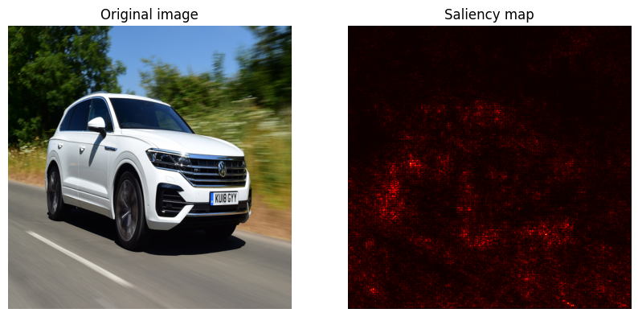
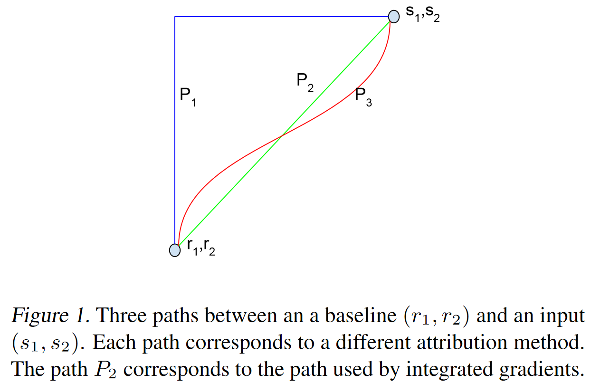
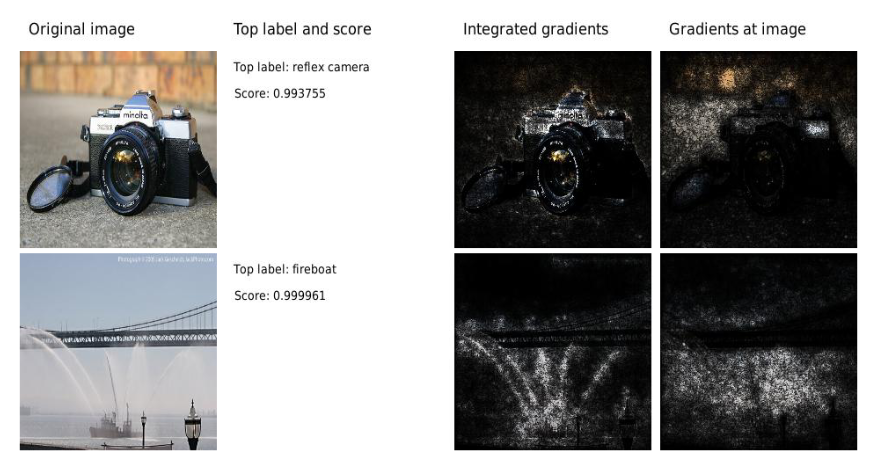

[Mukund Sundararajan](https://arxiv.org/search/cs?searchtype=author&query=Sundararajan%2C+M), [Ankur Taly](https://arxiv.org/search/cs?searchtype=author&query=Taly%2C+A), [Qiqi Yan](https://arxiv.org/search/cs?searchtype=author&query=Yan%2C+Q)

> We study the problem of attributing the prediction of a deep network to its input features, a problem previously studied by several other works. We identify two fundamental axioms---Sensitivity and Implementation Invariance that attribution methods ought to satisfy. We show that they are not satisfied by most known attribution methods, which we consider to be a fundamental weakness of those methods. We use the axioms to guide the design of a new attribution method called Integrated Gradients. Our method requires no modification to the original network and is extremely simple to implement; it just needs a few calls to the standard gradient operator. We apply this method to a couple of image models, a couple of text models and a chemistry model, demonstrating its ability to debug networks, to extract rules from a network, and to enable users to engage with models better.

## 简介

本文介绍了一种神经网络的可视化方法：`积分梯度（Integrated Gradients）`，是一篇 2016-2017 年间的工作。

所谓可视化，简单来说就是对于给定的输入 $x$ 以及模型 $F(x)$，想办法指出 $x$ 的哪些分量对模型的预测有较大的影响，或者说 $x$ 各个分量的重要性做个排序，而专业的话术就是`归因`(Attribution)。一个朴素的思路是直接使用梯度 $\nabla _{x}F(x)$ 来作为 $x$各个分量的重要性指标，而积分梯度是对它的改进。

<!--truncate-->

## 朴素梯度

考虑一个图片分类系统，将输入图 $x$ 分为$C$个类别中的一个，对于每个类$c\in C$，都有一个函数$S_c(x)$将输入$x$映射到类别空间的得分，分类结果则取决于哪个映射值最大，即

$$
class(x)=\argmax_{c\in C} S_c(x)
$$

如果$S_c(x)$本事就是可导的，一个简单的方法就是直接对$S_c(x)$求导，即

$$
M_c(x)=\nabla_x S_c(x)
$$

这里的$M_c(x)$表示$x$上的每个像素上的微笑扰动对类别$c$得分的影响。

这种方法在实际操作中确实能显示出与分类结果相关的区域，但求得的 saliency maps 通常在视觉上有很多的噪点(对这些噪点作用目前还不清楚，有可能这些噪点看似随机，实际上对网络的运作有很大的影响，也有可能这些噪点本身就不重要)，但正是因为这些噪点的存在，导致只能大致确定相关区域的位置，而不能给出符合人类理解的结果，如下图：

产生噪点的可能原因在于$S_c$函数的导数在小范围内有很大的波动，毕竟没有任何理由要求该函数是平滑的，而且网络通常采用$ReLU$作为非线性激活函
数，所以$S_x$甚至不是连续可导的。

下面给一特定图片加一微小的扰动，观察其中一个像素的偏导数的变化情况：

从数学层面推导，它就是基于泰勒展开

$$
\begin{align}
F(x+\Delta x)-F(x)&\approx \left \langle \nabla_xF(x),\Delta x \right \rangle =\sum_i[\nabla_xF(x)]_i\Delta x_i
\end{align}
$$

其中$\Delta x_i$是一个微小的扰动，$\Delta x_i=\epsilon_i$，$\epsilon_i$是一个微小的随机噪声。

$\nabla_xF(x)$是大小跟$x$一样的向量，这里$[\nabla_xF(x)]_i$为它的第$i$个分量，那么对于同样大小的$\Delta x_i$，$[\nabla_xF(x)]_i$的绝对值越大，那么$F(x+\Delta x_i)$相对$F(x)$的影响越大。也就是说：

> $[\nabla_xF(x)]_i$衡量了模型对输入的第$i$个分量的敏感程度，所以用$|[\nabla_xF(x)]_i|$作为第$i$个分量的重要性指标。

这种思路比较简单，很多时候它确实可以成功解释一些模型，但是它也有明显的缺点。一旦进入到了饱和区(典型的就是 ReLU 的负半轴)，梯度就为 0 了，那就揭示不出什么有效信息了。

按照论文中的描述就是说违反了$Sensitivity$公理。

公理: $Sensitivity$

> 定义：如果对于所有仅在一个特征上具有不同取值的输入 ($input$) 和基线 $(baseline)$ ，并且模型为两者给出了不同的预测。那么，那个不同取值的特征应该被赋予一个非 0 归因。若一个归因方法满足上面的要求，则称该归因方法满足 $Sensitivity$。

举个例子，一个单变量$ReLU$网络

$$
f(x)=1-ReLU(1-x)=\left\{\begin{matrix}
x,x<1\\
1,x\geq 1
\end{matrix}\right.
$$

假设基线$(baseline)$为$x=0$并且输入$x=2$，那么显然$f(0)=0,f(2)=1$。下面检测是否满$Sensitivity$公理：

首先，输入$x=2$和基线$x=0$不同；其次，输入$f(x=2)=1$与基线$f(x=0)=0$也不同；不违法$Sensitivity$公理的归因方法应该为输入$x$归因一个非 0 值，但是梯度在$x=2$时为 0，所以不满足$Sensitivity$公理。

## 积分梯度

### 参照背景

首先，我们需要换个角度来理解原始问题：我们的目的是找出比较重要的分量，但是这个重要性不应该是绝对的，而应该是相对的。比如，我们要找出近来比较热门的流行词，我们就不能单根据词频来找，不然找出来肯定是“的”、“了”之类的停用词，我们应当准备一个平衡语料统计出来的“参照”词频表，然后对比词频差异而不是绝对值。这就告诉我们，为了衡量 $x$ 各个分量的重要性，我们也需要有一个“参照背景”$\bar{x}$。

很多场景下可以简单地让$\bar{x}=0$，但这未必是最优的，比如还可以选择$\bar{x}$为所有训练样本的均值。我们期望 $F(\bar{x})$应当给一个比较平凡的预测结果，比如分类模型的话，$\bar{x}$的预测结果应该是每个类的概率都很均衡。于是我们去考虑 $F(\bar{x})−F(x)$，我们可以想象为这是从 $x$ 移动到 $\bar{x}$ 的成本。

如果还是用近似展开，那么我们可以得到

$$
\begin{align}
F(\bar{x})-F(x)\approx\sum_i[\nabla_x F(x)]_i[\bar{x}-x]_i
\end{align}
$$

对于上式，我们就可以有一种新的理解

> 从 $x$ 移动到 $\bar{x}$ 的总成本为$F(\bar{x})-F(x)$，它是每个分量的成本之和，而每个分量的成本近似为$[\nabla_x F(x)]_i[\bar{x}-x]$，所以我们可以用$|[\nabla_xF(x)]_i[\bar{x}-x]_i|$作为每个$i$分量的重要性指标。

当然，不管是$[\nabla_xF(x)]_i$还是$|[\nabla_xF(x)]_i[\bar{x}-x]_i|$，它们的缺陷在数学上都是一样的（梯度消失），但是对应的解释缺并不一样。

### 积分恒等

前面$|[\nabla_xF(x)]_i[\bar{x}-x]_i|$不够好是因为公式$(2)$不够精确，那如果能找到一个精度相等的类似表达式，那么就可以解决这个问题了。积分梯度正是找到了这样的一个表达式：

设$\gamma(a),a\in[0,1]$代表连接$x$和$\bar{x}$的一条参数曲线，其中$\gamma(0)=x,\gamma(1)=\bar{x}$，那么我们就有

$$
\begin{aligned}
F(\bar{x})-F(x) &=F(\gamma(1))-F(\gamma(0)) \\
&=\int_{0}^{1} \frac{d F(\gamma(\alpha))}{d \alpha} d \alpha \\
&=\int_{0}^{1}\left\langle\nabla_{\gamma} F(\gamma(\alpha)), \gamma^{\prime}(\alpha)\right\rangle d \alpha \\
&=\sum_{i} \int_{0}^{1}\left[\nabla_{\gamma} F(\gamma(\alpha))\right]_{i}\left[\gamma^{\prime}(\alpha)\right]_{i} d \alpha
\end{aligned}
$$

可以看到，式子(3)具有跟式(2)相同的形式，只不过将$[\nabla_xF(x)]_i[\bar{x}-x]_i$换成了$\int_{0}^{1}\left[\nabla_{\gamma} F(\gamma(\alpha))\right]_{i}\left[\gamma^{\prime}(\alpha)\right]_{i} d \alpha$，但式子(3)的是精确的积分恒等式，所以积分梯度就提出使用

$$
\begin{align}
\left|\int_{0}^{1}\left[\nabla_{\gamma} F(\gamma(\alpha))\right]_{i}\left[\gamma^{\prime}(\alpha)\right]_{i} d \alpha\right|
\end{align}
$$

作为第$i$个分量的重要性度量。但是这两点间有无数路径，如图

作为最简单的方案，就是将$\gamma(a)$取为两点之间的直线，即

$$
\gamma(a)=(1-a)x+a\bar{x}
$$

这时候积分梯度具体化为

$$
\left|\left[\left.\int_{0}^{1} \nabla_{\gamma} F(\gamma(\alpha))\right|_{\gamma(\alpha)=(1-\alpha) x+\alpha \bar{x}} d \alpha\right]_{i}[\bar{x}-x]_{i}\right|
$$

所以相比于$|[\nabla_xF(x)]_i[\bar{x}-x]_i|$，用梯度的积分$\int_{0}^{1}\left[\nabla_{\gamma} F(\gamma(\alpha))\right]_{i}\left[\gamma^{\prime}(\alpha)\right]_{i} d \alpha$替换$\nabla_xF(x)$，也就是从$x$到$\bar{x}$的直线上每一点的梯度的平均结果。直观上来看，由于考虑了整条路径上的所有点的梯度，因此就不再某一点的梯度为 0 的限制了。

### 离散近似

最后这个积分着实有点恐怖。积分梯度可以通过求和来高效地做近似计算，只需要将基线$\bar{x}$至$x$直线上足够间隔点的梯度相近即可。

$$
\left|\left[\frac{1}{n} \sum_{k=1}^{n}\left(\left.\nabla_{\gamma} F(\gamma(\alpha))\right|_{\gamma(\alpha)=(1-\alpha) x+\alpha \bar{x}, \alpha=k / n}\right)\right]_{i}[\bar{x}-x]_{i}\right|
$$

## 实验效果

在分类问题中的效果

在自然语言中的效果

## 附录

[integrated_gradients](https://tensorflow.google.cn/tutorials/interpretability/integrated_gradients?hl=zh-cn)

[Saliency Maps Picture](https://github.com/wmn7/ML_Practice/blob/master/2019_07_08/Saliency%20Maps/Saliency%20Maps%20Picture.ipynb)
